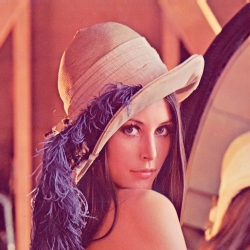
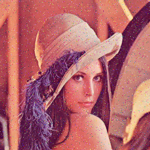

# AECC
***The Art of Error Correcting Coding***

BCH encoder and decoder written using modern C++17 features,
multithreading, Object Oriented Programming and many good practices.

This program simulates a bch encoded transmission through a noisy channel.
It divides the given image into message polynomials which are then encoded
and the errors are simulated with a given probability. They are afterwards decoded.
After the whole process there is a table with the informations of the process and
if you wish you can take a look at three pictures: the original image, image with errors
and the image with errors fixed. Currently there are 4 BCH codes supported.

<pre>
Usage:
./bch_simulator [-h] -i image -p err_prob -c code_type [-v]

Options:
  -i image      Choose one image from images folder, example: images/image2.bmp.
                  (image has to be in bmp format without compression)
  -p err_prob   Give probability between 10 and 10000000. A 1 in err_prob error will occur in
                  the codeword during the simulated transmission through a noisy medium, example: 1000.
  -c code_type  Choose bch code type:
                        0 - BCH(63, 51, 5)
                        1 - BCH(63, 45, 7)
                        2 - BCH(48, 36, 5)
                        3 - BCH(48, 30, 7)
Optional arguments:
  -h    Show this help message.
  -v    Enable bch_logger encoding and decoding logs which will print out the whole process to the
          terminal, is disabled by default. WARNING! This option causes the threads to run sequentially instead
          of in parallel which combined with printing operations to console causes a severe performance degradation.

Example program output:

./bch_simulator -i images/lenna.bmp -p 100 -c 3
number of detected threads: 8
Parsing image file...
Parsing image file done and it took: 0.009 seconds
Primitive polynomial:
p(x) = x^6 + x^4 + x^3 + x + 1
This is a (48,30,7) binary bch code
g(x) is 1001010101000110011
Coding and decoding process done and it took: 0.503 seconds
Converting modified and recovered data from bitsets to bytes...
Converting modified and recovered data from bitsets to bytes done and it took: 0.022 seconds

+-----------------------------------------+-------------------+
| Code used                               | (48,30,7)         |
+-----------------------------------------+-------------------+
| Original image used                     | images/lenna.bmp  |
+-----------------------------------------+-------------------+
| Given error probability                 | 0.010000          |
+-----------------------------------------+-------------------+
| Real error probability                  | 0.010000          |
+-----------------------------------------+-------------------+
| Number of all data bits                 | 2001000           |
+-----------------------------------------+-------------------+
| Number of all data + redundant bits     | 3201600           |
+-----------------------------------------+-------------------+
| Number of all introduced errors         | 31725             |
+-----------------------------------------+-------------------+
| Number of all message polynomials       | 66700             |
+-----------------------------------------+-------------------+
| Number of successful decodings          | 66611             |
+-----------------------------------------+-------------------+
| Number of decoding errors               | 89                |
+-----------------------------------------+-------------------+
| Number of uncaught decoding errors      | 19                |
+-----------------------------------------+-------------------+
| Number of over t errors in codewords    | 80                |
+-----------------------------------------+-------------------+
| Final data bits difference              | 283               |
+-----------------------------------------+-------------------+
| Encoding and decoding time              | 0.503 seconds     |
+-----------------------------------------+-------------------+

Results have been written to BCH_logs.txt file

To view made images on linux use "feh -F -Z --force-aliasing -d images/lenna.bmp images/lenna_with_errors_BCH4830.bmp images/lenna_fixed_BCH4830.bmp"

</pre>
inspiration: http://the-art-of-ecc.com
